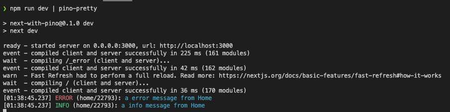
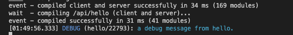

# Better Logging in Next.js Apps with Pino

As the popularity of Next.js increases, so do the size and the complexity of the applications build with it. As season developers can attest, logging can be an extremely helpful tool for isolating problems during development and debugging production problems. The Next.js team recommends Pino for logging for Next.js applications. A good logging solution should support the following features:

1.  minimum performance overhead to the application,
2.  ability to set the logging level of each log statement,
3.  ability to send logging data to various transport targets, eg: console, file, etc.,
4.  support pretty format during development and JSON format for easy integration with other logging solutions,
5.  ability to set the logging level of each module/component without modifying the code of the module.

The first 3 items in the above list can be easily achieved with Pino. I will present a technique to achieve Item #4 in this article.

## Create the Sample App

```
npx create-next-app next-with-pino --typescript
```

The above command creates a new Next.js application for us to demonstrate the logging technique.

## Add Pino Dependencies

The following command installs the only dependencies needed in this article:

```
npm install pino
```

## Log Level Configuration

The `log-level.js` file enables developers to specify the logging level for each module. This configuration will work in conjunction with functions defined in `logging/log-util.ts`.

```javascript
// file: log-level.js

const logLevelData = {
  "*": "silent",
  home: "info",
};

export default logLevelData;
```

Line #4: `*` is used as a wild card that matches all modules
Line #5: specifies the logging level for the `home` module is `info`

```javascript
// file: logging/log-util.ts

import logLevelData from "../log-level";
import pino, { Logger } from "pino";

const logLevels = new Map<string, string>(Object.entries(logLevelData));

export function getLogLevel(logger: string): string {
  return logLevels.get(logger) || logLevels.get("*") || "info";
}

export function getLogger(name: string): Logger {
  return pino({ name, level: getLogLevel(name) });
}
```

Two logging utility functions are defined in the above file:

1. `getLogLevel(logger)` — will return the current logging level a logger is set at.
2. `getLogger(name)` — creates a new logger for the specified name.

Line #3 imports the logging level defined in the `log-level.js` file. This data is used to create a map between modules and the corresponding log level.

## Using the Logging Utilities in Pages

With the configuration and utility functions defined, we can now look at how we can leverage them.

```javascript
// file: pages/_app.tsx
import "../styles/globals.css";
import type { AppProps } from "next/app";
import { getLogger } from "../logging/log-util";

export default function App({ Component, pageProps }: AppProps) {
  const logger = getLogger("app");

  logger.error("a error message from _app");
  logger.debug("a debug message from _app");
  logger.info("a info message from _app");

  return <Component {...pageProps} />;
}
```

Line #4: imports the `getLogger` function for us to create new `loggers`
Line #7: create a new logger with the name `app`
Line #9–11: call the logger to create an error, a debug, and an info log entry

With the logging levels for `app` not specified in `log-level.js` file and the default (`*`) log level set to `silent`, there will not be any log entry print from the `app` module.

```javascript
// file: pages/index.tsx

import Head from "next/head";
import { getLogger } from "../logging/log-util";
import styles from "../styles/Home.module.css";

export default function Home() {
  const logger = getLogger("home");

  logger.error("a error message from Home");
  logger.debug("a debug message from Home");
  logger.info("a info message from Home");

  return (
    <div className={styles.container}>
      <Head>
        <title>Create Next App</title>
        <link rel="icon" href="/favicon.ico" />
      </Head>
      <main className={styles.main}>
        <h1 className={styles.title}>
          Welcome to <a href="https://nextjs.org">Next.js!</a>
        </h1>
      </main>
    </div>
  );
}
```

Similarly, Lines #4, #8, and #10–12 in the `pages/index.tsx` are logging related statements. With the logging level for `home` set to `info`, the `debug` level log entry is not printed:



When the page is loaded, note that we only see the log entry from the `home` module, and nothing from the `app` module, as expected based on the log-level configuration.

<b>Note</b>: Pino log entries are in JSON format by default, the log entries have been piped to the `pino-pretty` extension module. I prefer it over the JSON format during development.

## Using the Logging Utilities in API End-Points

In addition to using our custom logging utility functions in code under the pages folder, they can also be used in the API end-point code.

```javascript
// /api/hello.ts

import type { NextApiRequest, NextApiResponse } from "next";
import { getLogger } from "../../logging/log-util";

type Data = {
  name: string,
};

export default function handler(
  req: NextApiRequest,
  res: NextApiResponse<Data>
) {
  const logger = getLogger("hello");
  logger.debug("a debug message from hello.");

  res.status(200).json({ name: "John Doe" });
}
```

After adding an entry to the `log-level.js` configuration and setting the `hello` module logging level to `debug`, a log entry is also printed from the `hello` module.



## Summary

Logging is very important during application development and production. Using a couple of simple utility functions, creating loggers and setting logging levels by modules becomes simple. Working on an application with many components, separating logging into modules, and having the ability to control which module we like to hide/show the logs will help us reduce the number of log entries we need to read and improve our productivity.

If you would like to check out the code described in this article, you can clone it from [Github](https://github.com/tatleung/next-with-pino).
